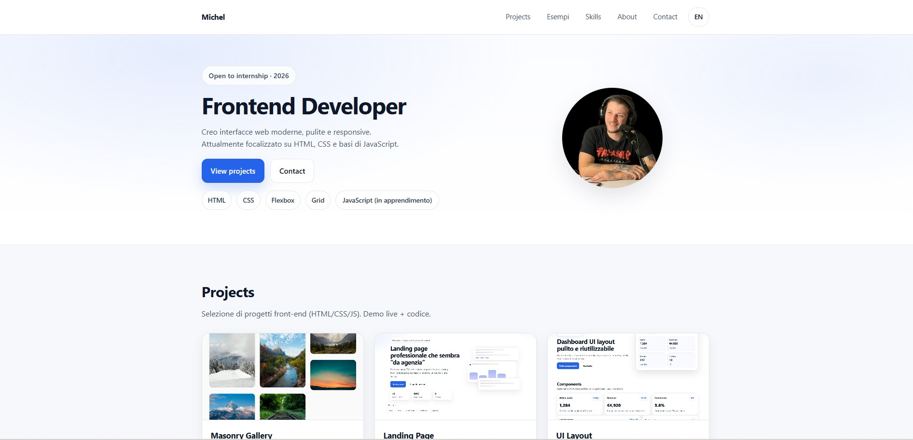
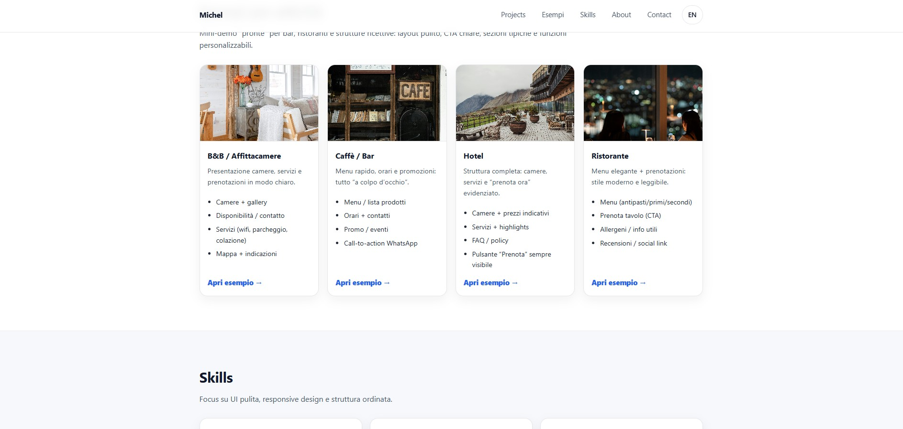

# Portfolio  -  Michel Branche

Portfolio personale con una selezione di progetti front-end.  
Focus su **UI moderna**, **responsive design** e componenti riutilizzabili.

## 🔗 Live Website
- Website: https://michelbranche.github.io/portfolio/

## 🧰 Tech Stack
- HTML5
- CSS3
- JavaScript (base)

## 📌 Progetti
- **Masonry Gallery (Pinterest-style)**
  - Live: https://michelbranche.github.io/masonry-gallery/
  - Code: https://github.com/MichelBranche/masonry-gallery

- **Landing Page**
  - Live: https://michelbranche.github.io/landing-page/
  - Code: https://github.com/MichelBranche/landing-page

- **UI Layout**
  - Live: https://michelbranche.github.io/ui-layout/
  - Code: https://github.com/MichelBranche/ui-layout

- **Easy Calculator**
  - Live: https://michelbranche.github.io/Easy-Calculator/
  - Code: https://github.com/MichelBranche/Easy-Calculator

- **Esempi per attività** (demo rapide: B&B, Caffè, Hotel, Ristorante)
  - IT: https://michelbranche.github.io/portfolio/examples.html
  - EN: https://michelbranche.github.io/portfolio/examples-en.html

> Aggiungerò altri progetti man mano che procedo con lo studio e con il mio percorso da frontend developer.

## 📸 Preview






## 📂 Struttura
```txt
portfolio/
  index.html
  style.css
  masonry-gallery.html
  assets/
    images/
      michel.jpg
      masonry-thumb.jpg
      portfolio-preview.jpg
